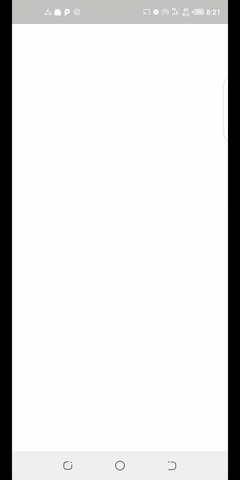

## Zikk

A sample media player application making use of android MediaPlayer Apis
The sample is still under development and may contain a number of bugs.Feel
free to file an issue if you spot one or send a PR😎

### Demo/Screenshots



### Prerequisites

Setup a firebase project and hook it up.

### License
```
  Copyright 2020 David Odari
 
  Licensed under the Apache License, Version 2.0 (the "License"); you may not use this file except
  in compliance with the License. You may obtain a copy of the License at
             http://www.apache.org/licenses/LICENSE-2.0
  Unless required by applicable law or agreed to in writing, software distributed under the License
  is distributed on an "AS IS" BASIS, WITHOUT WARRANTIES OR CONDITIONS OF ANY KIND, either express
  or implied. See the License for the specific language governing permissions and limitations under
  the License.
 ```
